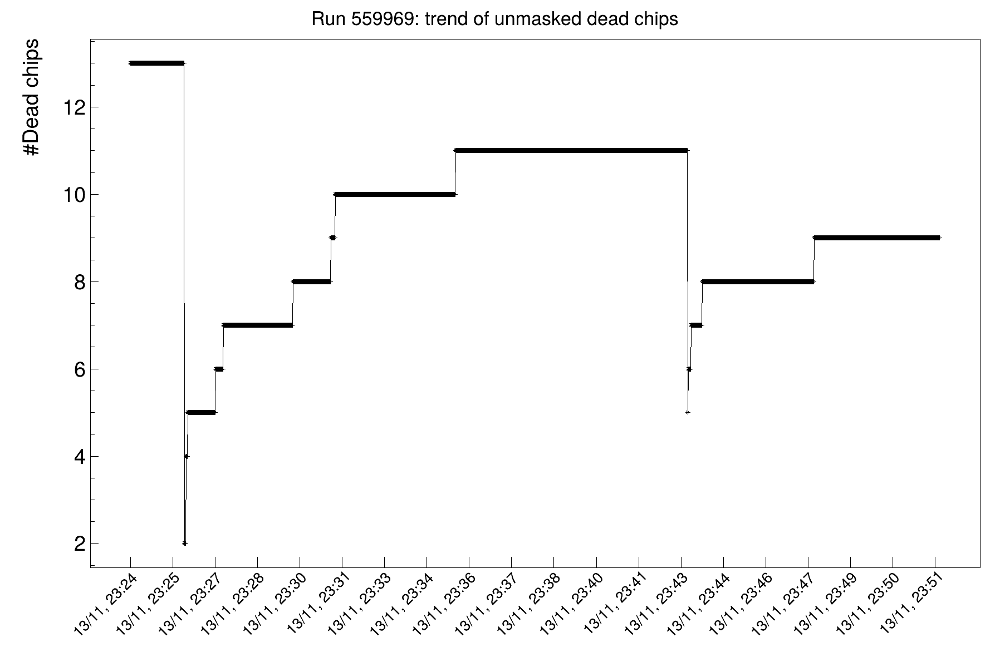
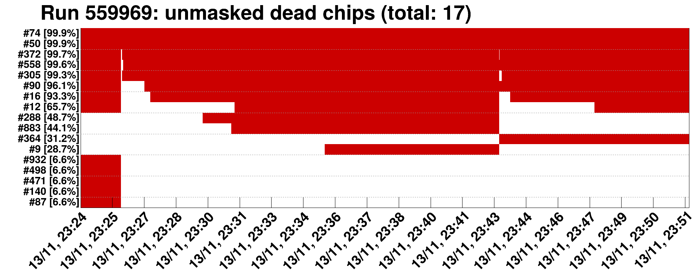

# MFT Dead Maps
A tool to visualize the contents of MFT dead maps for a given run (or a group of runs).

## First steps:
1. Connect to LXPLUS: `ssh -X <user>@lxplus`
2. Load the ALICE environment. For example: `/cvmfs/alice.cern.ch/bin/alienv enter VO_ALICE@O2Physics::daily-20241102-0000-1` (this is a November 2024 release, any newer one can be picked up). Alternatively: 
  - `export PATH=/cvmfs/alice.cern.ch/bin:$PATH`
  - `alienv enter VO_ALICE@O2Physics::daily-20241102-0000-1`
3. Initialize the GRID token: `alien-token-init <user>` (if not already done, you need to export the GRID certificate into the `.globus` directory first: https://alice-doc.github.io/alice-analysis-tutorial/start/cert.html)

## The first time you use the script:
1. Clone the repo in LXPLUS: `git clone https://github.com/grundd/mft-deadmaps.git`
2. Navigate to the folder: `cd mft-deadmaps/`
3. Enable the bash script: `chmod +x run_deadmaps.sh`

## How to run the script:
1. Log into LXPLUS and go to the deadmaps folder: `cd mft-deadmaps/`
2. Either run the ROOT macro directly: `root -b -l -q mft_deadmaps.cxx\(<runNumber>\)`
3. Or use the bash script: `./run_deadmaps.sh`. This allows you to automatically loop over many runs at the same time, but VS Code (or similar) is preferable for editting the script remotely via SSH.

## Output
Output plots are stored in the `mft-deadmaps/<runNumber>/` subfolder. 

Example of a trending plot:

Example of a plot showing fractions of time when chips were dead (only unmasked chips are shown):

To download the plots from LXPLUS to the local machine, either do it directly in VS Code, or:
1. Create a zip file in LXPLUS: `tar cvzf <runNumber>.zip <runNumber>/`
2. Open another terminal window on the local machine and execute: `scp <user>@lxplus:/afs/cern.ch/user/<letter>/<user>/mft-deadmaps/<runNumber>.zip Downloads/`

